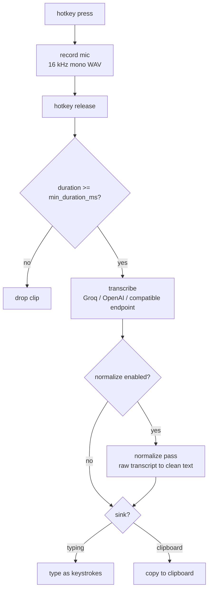

# zhisper

Press a key, talk, let go. Your words land as text in whatever window you were typing in.

`zhisper` is a push-to-talk dictation daemon written in Zig. It captures your microphone through miniaudio, sends the clip to a Whisper-compatible transcription endpoint, and injects the result as real keystrokes — so it works in any application, not just a chat box.

- Hold a key to talk, release to transcribe and type.
- A second key throws the current recording away.
- A third can route a recording to the clipboard instead of typing it.
- Which keys those are is up to you — see [Key codes](#key-codes). There are working defaults if you would rather not pick.
- Runs on **Linux, Windows, and macOS** from the same source.

## Table of contents

- [How it works](#how-it-works)
- [Build](#build)
- [Setup](#setup)
- [Usage](#usage)
- [Configuration](#configuration)
- [Key codes](#key-codes)
- [Environment variables](#environment-variables)
- [Optional text normalization](#optional-text-normalization)
- [Development](#development)
- [Project layout](#project-layout)

## How it works



A single-slot work queue means you never block the hotkey loop: one clip is transcribing while the next one records. The queue holds at most one waiting clip, so memory stays flat no matter how fast you talk, and the oldest waiting clip is dropped (with a notification) rather than growing without bound.

The overlay pill, system tray icon, and desktop notifications all reflect the same three states: **idle**, **recording**, **working**.

## Build

Requires **Zig 0.16.0** — the version is pinned in `build.zig.zon`.

```sh
zig build                # → zig-out/bin/zhisper
zig build test           # all tests (library + exe, in parallel)
zig fmt                  # format (CI expects a clean tree)
```

The first build compiles the vendored C (miniaudio, SDL3, and per-platform tray/notify shims), so it is slow. Later builds are cached.

Cross-compile checks:

```sh
zig build -Dtarget=x86_64-windows
zig build -Dtarget=aarch64-macos
```

## Setup

### 1. Get an API key

| Provider | Env var | Default model | Endpoint |
|---|---|---|---|
| `groq` (default) | `GROQ_API_KEY` | `whisper-large-v3-turbo` | `https://api.groq.com/openai/v1/audio/transcriptions` |
| `openai` | `OPENAI_API_KEY` | `whisper-1` | `https://api.openai.com/v1/audio/transcriptions` |
| `custom` | `ZHISPER_API_KEY` | *you choose* | *you choose* (`base_url` required) |

Keys are **environment variables only**. Putting `api_key` in the config file is a hard startup error, by design.

```sh
export GROQ_API_KEY="gsk_..."
```

### 2. Create a config file

Copy [`config.example.toml`](config.example.toml) to the platform config directory:

| OS | Path |
|---|---|
| Linux | `~/.config/zhisper/config.toml` |
| Windows | `%APPDATA%\zhisper\config.toml` |
| macOS | `~/Library/Application Support/zhisper/config.toml` |

The file is entirely optional — the defaults work out of the box. Every key is documented inline in `config.example.toml`.

### 3. Run it

```sh
zig build run            # from a checkout
./zig-out/bin/zhisper    # an installed binary
```

Hold the record key and talk.

## Usage

```
usage zhisper [options...]

options:
  -h, --help                     print this help and exit
      --provider=<str>           groq | openai | custom
      --model=<str>              model (empty = preset)
      --base-url=<str>           base URL (provider=custom only)
      --prompt=<str>             transcription prompt
      --key-code=<uint>          hotkey code (default 67=F9)
      --mode=<str>               hold | toggle
      --cancel-key-code=<uint>   cancel key (46=C)
      --evdev=<str>              Linux evdev path/name:DEV (empty = auto-scan)
      --device=<str>             mic (empty = default)
      --list-devices             list mics and exit
      --wav-path=<str>           wav output path
      --min-duration-ms=<uint>   drop clips below this length (ms)
      --keep-wav                 keep WAV on error
      --no-keep-wav              don't keep WAV on error
  -v, --verbose                  verbose logging
```

Precedence is **CLI > env > config file > defaults**.

A few things worth knowing:

- **`--list-devices`** prints every capture device the backend can see. Feed the name (or a substring of it) to `[audio] device` or `--device`.
- **`--mode=toggle`** switches to press-to-start / press-to-stop instead of hold-to-talk.
- **Clips under `min_duration_ms`** (default 500) are discarded without an API call. A too-short clip and a silent clip are both reported, so "nothing happened" always has a reason.
- **Trailing newlines are stripped** by default (`daemon.trailing_newline = "strip"`). Whisper output routinely ends in a newline, and emitting that as a real Return can submit a chat message mid-sentence. Set it to `"send"` if you want it.
- **SIGINT / SIGTERM** drain the active job plus one waiting job, then exit. On Windows the process exits abruptly instead.
- **Linux only** — global hotkeys need access to a keyboard device. Either run with permission to read `/dev/input/event*`, or point at a specific one:
  ```sh
  zhisper --evdev=/dev/input/event5     # explicit, stable but breaks if event numbers change
  zhisper --evdev=name:kanata            # by device name, survives reboots (recommended)
  ```

## Configuration

`config.example.toml` is the reference. The shape:

```toml
[transcribe]
provider = "groq"
model = ""
base_url = ""
prompt = ""

[hotkey]
key_code = 67            # default F9; yours to change, see "Key codes"
mode = "hold"            # hold | toggle
cancel_key_code = 46     # default C
clipboard_key_code = -1  # off; a recording started with this key lands in the clipboard
evdev = ""
evdev_name = ""

[audio]
device = ""              # empty = system default mic

[normalize]
enabled = false

[daemon]
min_duration_ms = 500
wav_path = ""            # empty = platform temp dir
trailing_newline = "strip"
type_delay_ms = 0
keep_wav_on_error = true
overlay = true
tray = false
notify = "errors,clipboard"
verbose = false
```

Notes:

- The config is **strict**. An unrecognized key is a startup error rather than a silent no-op, so a typo tells you immediately instead of doing nothing.
- `daemon.notify` accepts `off`, `errors`, `clipboard`, or `errors,clipboard`. It covers the outcomes that otherwise leave you guessing: too-short clip, silent clip, dropped waiting clip, transcription failure, empty transcript, clipboard failure, and clipboard ready (with a short preview).
- `daemon.overlay` and `daemon.tray` are independent — the tray icon reflects state even when the floating pill is off, and vice versa.
- `daemon.verbose` adds one metadata line per API call (model, payload sizes, status, latency, upstream error body). It never logs keys, audio, or transcripts.

## Key codes

You choose which keys do what, in `[hotkey]`:

| Setting | Default | Meaning |
|---|---|---|
| `key_code` | 67 | Press-and-hold to record; release to stop and transcribe |
| `cancel_key_code` | 46 | Discard the recording in progress |
| `clipboard_key_code` | -1 (off) | Record, then put the transcript on the clipboard instead of typing it |
| `mode` | `"hold"` | `hold` = talk while held, `toggle` = press to start, press to stop |

Set a key to `-1` (or any negative value) to disable it. `0` is a real key on macOS (`kVK_ANSI_A`), not a disable.

### Finding the code for your key

`zhisper` uses each operating system's **native** key code, and those encodings are different — a code that works on one platform means nothing on the others. Look yours up in the platform's own reference:

**Linux** — `input-event-codes.h`, the `KEY_*` constants
<https://www.kernel.org/doc/html/latest/input/input-event-codes.html>

**macOS** — Carbon `Events.h`, the `kVK_*` constants
<https://developer.apple.com/documentation/coregraphics/1588252-ansikeys>

**Windows** — `WinUser.h`, the `VK_*` virtual-key codes
<https://learn.microsoft.com/en-us/windows/win32/inputdev/virtual-key-codes>

A few to orient you, not a complete list — the references above are the complete list:

| Key | Linux | macOS | Windows |
|---|---|---|---|
| A | 30 | 0 | 0x41 |
| C | 46 | 8 | 0x43 |
| F9 | 67 | 0x78 | 0x78 |
| Return | 28 | 36 | 0x0D |

Copy the number as-is: the config takes the native value, so a Linux `KEY_*` constant goes in directly, and macOS/Windows values go in as decimal or hex (`0x0D` and `13` are the same number to the parser).

## Environment variables

| Variable | Purpose |
|---|---|
| `ZHISPER_API_KEY` | API key, wins over the provider-specific variables |
| `GROQ_API_KEY` / `OPENAI_API_KEY` | Key for the matching provider |
| `ZHISPER_DEBUG` / `ZHISPER_VERBOSE` | Enable debug logging on stdout (errors always log to stderr) |
| `TMPDIR` / `TMP` / `TEMP` | Where the WAV scratch file goes when `wav_path` is empty |

## Optional text normalization

Whisper gives you words, not prose. A second, off-by-default API call rewrites the transcript into clean written text: self-corrections resolved, spoken numbers and dates converted, filler words dropped, punctuation fixed.

```toml
[normalize]
enabled = true
styling = "semi-formal"   # casual | semi-casual | semi-formal | formal
structure = "prose"      # prose | lists
context = "general"      # general | email
```

- Uses the same API key — no second secret.
- This section is **watched at runtime**: flip `enabled` and it takes effect within a second, no restart.
- `base_url` can point at any OpenAI-compatible chat-completions endpoint, so the normalizer can run locally or on a different provider without recompiling.
- The three axes are closed sets; a value outside them is rejected at startup because the prompt format was only trained on these combinations.
- It costs one extra network round trip per recording, and it is **best-effort** — any failure falls back to the raw transcript rather than blocking dictation.

## Development

```sh
zig build test                       # the gate — must pass
RECORD_LIVE=1 zig build test         # opt-in real-mic smoke test
TRANSCRIBE_LIVE=1 zig build test     # opt-in real transcription test
NORMALIZE_LIVE=1 zig build test      # opt-in normalization comparison
ZHISPER_DEBUG=1 ./zig-out/bin/zhisper # debug logs
```

`test.sh` is a local convenience script for a live run against a real device; it is not part of CI.

Every OS-dependent feature follows the same seam: `feature.zig` picks the backend at comptime, the native code lives in `feature_<os>.zig`, shared types live in `feature_types.zig`, and `feature_stub.zig` provides an in-memory fake for tests. New OS-touching code is expected to copy that layout.

**Dependencies** (all fetched by `zig build`, never vendored by hand):

| Package | Used for |
|---|---|
| [miniaudio](src/miniaudio.c) | Microphone capture, device enumeration |
| [SDL3](https://codeberg.org/7Games/zig-sdl3) | Overlay pill rendering |
| [zstbi](https://github.com/zig-gamedev/zstbi) | Image decoding (Linux tray icons) |
| [sam701/zig-toml](https://github.com/sam701/zig-toml) | Config parsing |
| [argz](https://codeberg.org/chocapix/argz) | CLI argument parsing |

## Project layout

```
src/
  main.zig          daemon loop, work queue, signal handling
  root.zig          library entry point + test registration
  cli.zig           argv parsing
  config.zig        TOML config, env/CLI layering, validation
  audio.zig         miniaudio capture, WAV assembly
  wav.zig           WAV header writer
  transcribe.zig    Whisper-compatible transcription request
  normalize.zig     optional clean-written-text pass
  inject*.zig       keystroke injection (per OS)
  clipboard*.zig    clipboard write (per OS)
  hotkey*.zig       global hotkeys (per OS)
  overlay*.zig      floating status pill (SDL3)
  tray*.zig         system tray icon (per OS)
  notify*.zig       desktop notifications (per OS)
  log.zig           scoped logging
```

## License

See the repository for license terms.
